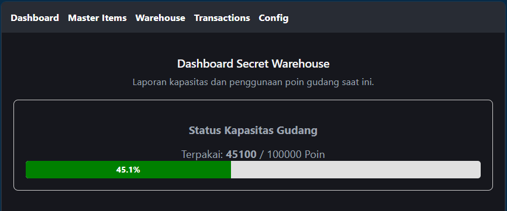
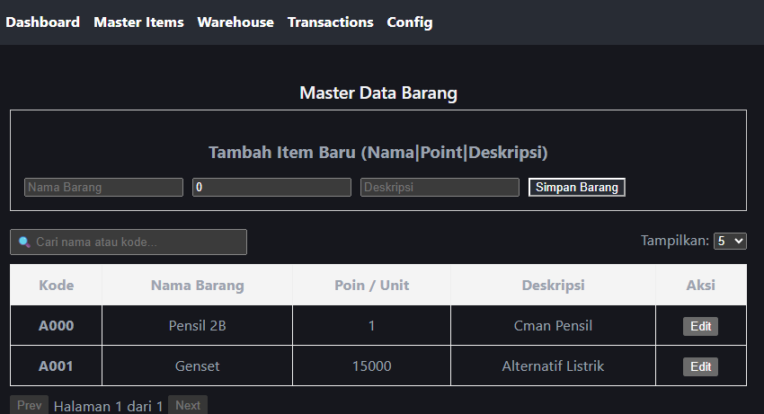
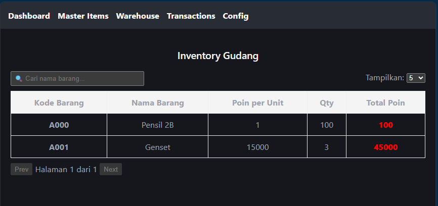
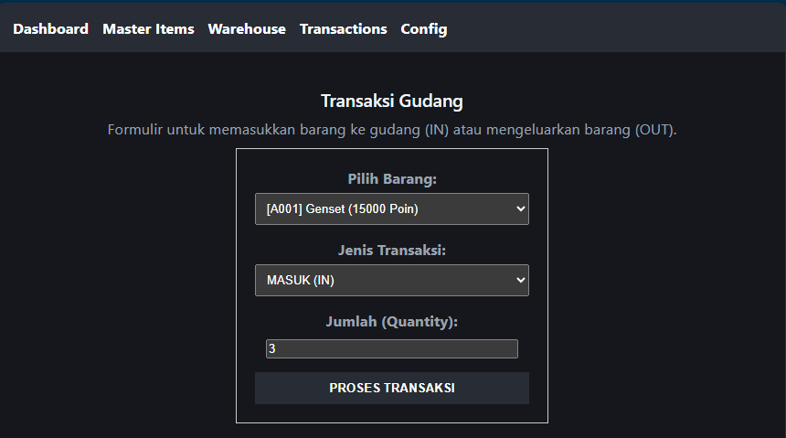
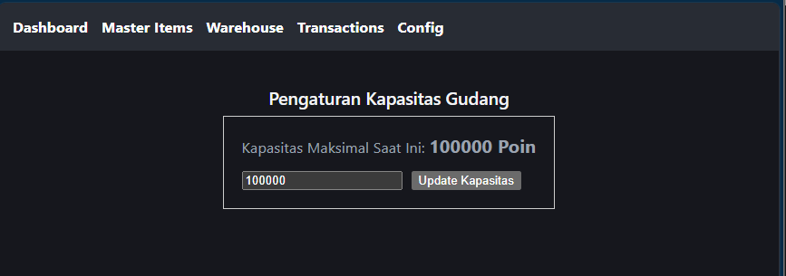

# Secret Warehouse System 📦

Website Project Latihan Sendiri berisi Simple Warehouse System yang memiliki poin kapasitas. 
Dibangun dengan React + Vite + NET10 dengan Onboard Memory DB (SQLite).

## 🛠️ Tech Stack
* **Frontend:** React, Vite, Axios, React Router v6.
* **Backend:** .NET 10 ASP.NET Core Web API, Entity Framework (EF) Core.
* ]**Database:** SQLite (Local/File-based DB).

## ✨ Fitur Utama

### 1. Point System Capacity (Kapasitas Berbasis Poin)
* Gudang menggunakan sistem poin untuk menentukan kapasitas, bukan berat atau jumlah fisik (Total Poin = *Quantity* x Poin per Unit).
* **Proteksi Over-Capacity:** Transaksi barang masuk otomatis ditolak jika gabungan poin barang baru dan poin terpakai melebihi kapasitas maksimal.
* **Proteksi Penurunan Kapasitas:** Kapasitas maksimal gudang di menu Config tidak bisa diturunkan di bawah total poin barang yang saat ini sudah *stay* di dalam gudang.

### 2. Master Items (Manajemen Barang)
* Pembuatan item baru secara otomatis akan mendapatkan *Auto-Generate Code* dengan format alfabet-numerik berurutan (mulai dari A000 hingga Z999).
* Tabel Master Item dilengkapi dengan fitur pencarian (*Search*), *Paging* dinamis (5, 10, atau 15 baris), serta opsi untuk mengedit (*Update*) detail barang.

### 3. Inventory & Transactions
* Mendukung formulir transaksi masuk (IN) dan keluar (OUT) melalui menu *Dropdown* pilihan barang.
* Tabel *Warehouse* menampilkan daftar stok *real-time* yang ada di gudang beserta beban poin masing-masing, dilengkapi fitur *Search* dan *Paging*.

### 4. Interactive Dashboard
* Halaman utama menampilkan visualisasi *Progress Bar* yang menghitung persentase ruang kapasitas gudang yang telah terpakai secara *real-time*.

---

## 🚀 Cara Menjalankan Proyek (Local Development)

Proyek ini terbagi menjadi dua bagian utama: **Backend** (`secret_warehouse`) dan **Frontend** (`secret_warehouse_fe`). 

### A. Menjalankan Backend (.NET 10 API)
1. Buka terminal dan arahkan ke folder utama backend.
2. Pastikan *tool* Entity Framework sudah terinstal, lalu jalankan migrasi untuk membuat file SQLite (`secret_warehouse.db`):
   ```bash
   dotnet ef migrations add InitialCreate
   dotnet ef database update
   ```
3. Jalankan server API:
    ```bash
   dotnet run
   ```
4. Uji API dan dokumentasi Swagger bisa di
    ```bash
   http://localhost:5265/swagger
   ```
5. Jalankan React di cmd yang berbeda serts Instal semua dependencies (Axios, React Router, dll) lalu jalankan web FE:
    ```bash
   npm install
   npm run dev
    http://localhost:5173
   ```
---

## 🚀 Showacse Project





